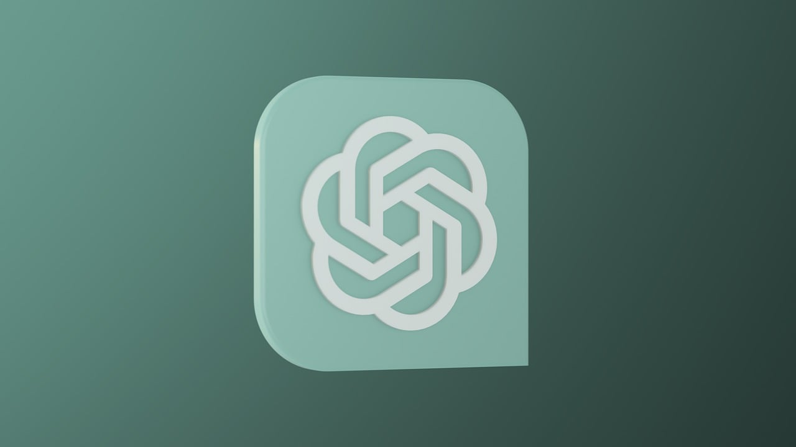

# Building with ChatGPT: A Practical Guide for Healthcare Developers

Are you ready to take advantage of ChatGPT's incredible potential in the field of healthcare administration? In this comprehensive guide, we will walk you through the process of seamlessly integrating ChatGPT into your healthcare applications. From accessing ChatGPT through APIs to customizing it for healthcare-specific use cases, you'll gain the knowledge and skills to drive innovation in healthcare.

## Accessing ChatGPT through APIs

ChatGPT's power lies in its APIs, which enable seamless integration with your applications. To get started, sign up for API access and obtain the necessary credentials. Once you have access, you can tap into ChatGPT's vast language capabilities to enhance your healthcare solutions.

API access opens up a world of possibilities, from streamlining patient interactions to automating administrative tasks. By leveraging ChatGPT, you can provide efficient and natural language interfaces for patients and healthcare professionals alike.

## Customizing ChatGPT for Healthcare-Specific Use Cases

One size does not fit all in healthcare, and ChatGPT's versatility shines when you tailor it to your specific needs. Customize its responses to address healthcare-related queries, assist with medical diagnoses, or provide information on treatment options.

By training ChatGPT on healthcare datasets and fine-tuning its responses, you can ensure that it aligns perfectly with your application's goals. The ability to adapt ChatGPT's language model to healthcare-specific use cases is a game-changer for developers.

## Step-by-Step Guide to Integrating ChatGPT into Healthcare Applications

Integrating ChatGPT into your healthcare applications is a straightforward process, and we're here to guide you every step of the way. Our step-by-step guide will help you set up ChatGPT within your application environment, ensuring a seamless user experience.

We'll cover topics such as API integration, response handling, and user interactions. Whether you're building a telemedicine platform or a healthcare chatbot, this guide will be your trusted companion.

## Showcasing Successful Implementations by the Community

Join a thriving community of healthcare developers who have harnessed the potential of ChatGPT to drive innovation. We're proud to showcase some real-world implementations that have made a significant impact in the healthcare sector.

Learn from their experiences, discover best practices, and gain insights into how ChatGPT can transform healthcare administration. The possibilities are endless, and your contribution to this growing community can make a difference.

---

*References:*

1. [ChatGPT API Documentation](https://chat.openai.com/docs/)
2. ["ChatGPT in Healthcare: Transforming Patient Interactions"](https://example.com/chatgpt-healthcare-transformations)

Ready to embark on your journey of healthcare innovation with ChatGPT? Start building today, and witness the transformation it can bring to healthcare administration.

*Disclaimer: ChatGPT is a powerful tool, but it should not be used as a substitute for professional medical advice or diagnosis.*

